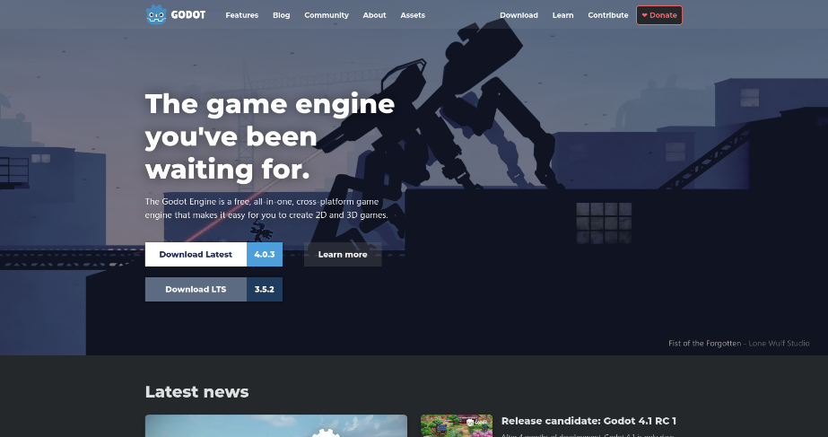
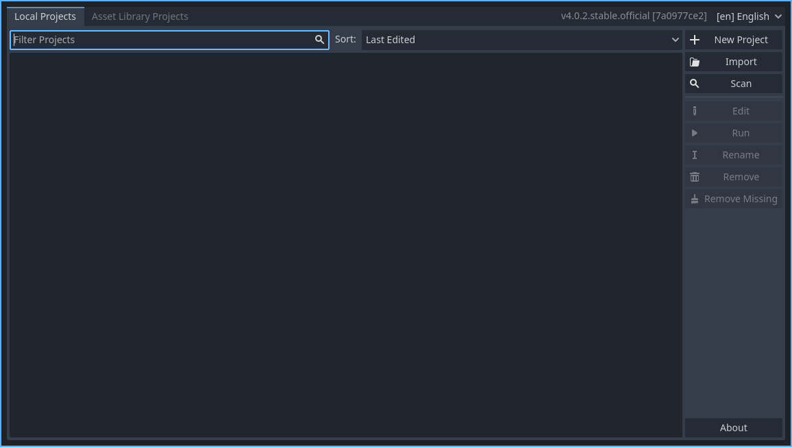

# Introduction

This engine was made in Godot v4.0.2 stable. The goal of this project was to both learn how to properly use Godot and to make a fangame engine which was simpler to understand, edit and learn from.
When Godot released its 4.0 version, many things ended up not being compatible with previous ones, so to make fangames I either had to update a previously existing one (smartkin's engine, moowool's godot, delicious spike engine, just to name a few), or make my own from scratch.

The only other game engine I used besides Godot was Game Maker, starting with GM8, then GM8.1 and finally GMS1.4. It took quite a lot of effort to learn a different game engine, and it's my own personal opinion that if you've made games with Game Maker before, you'll probably be better off sticking to it instead of making the jump to Godot. A big factor in making the switch for me was using a Linux distro as my main OS, which Godot supports and Game Maker does not, allowing me to get back into gamedev without having to use virtual machines or dual booting. After all, if I'm learning how to use a different OS, might as well learn how to use a new game engine, right?

### Before starting, a few things to be aware of:

* The engine was made without following other engine's conventions too strictly. The reasoning for this is that since Godot is an entirely different game engine from Game Maker, doing so would be impossible (physics and collisions would be too different regardless).
* This encourages experimentation, but discourages more conservative fangame styles such as needle, or perhaps even trap/troll. It was made with adventure fangames in mind, however, and based off previous projects of mine.
* The engine runs at 60fps, for the same reason. You can change it if you want, but you'll need to change several things as well.
* Learning Godot **will be challenging coming from Game Maker**, but will also open you to new possibilities, like trying other game engines, or making games in 3D.
* A basic understanding of Godot is to be expected when trying this fangame engine (I recommend using [this guide](https://www.youtube.com/watch?v=BhBQhmtFUd8), which you can find on youtube by searching for "Platformer Game Quick Start Guide for Godot 4 Beta". It will teach you the basics, and is very much recommended. I encourage you to follow it from start to finish, and trying my engine afterwards so you don't feel lost).
* This fangame engine was made in Godot v4.0.2. It will not work in versions previous to v4.X.

All in all, if you find yourself wanting to learn something new to challenge yourself, at the low price of $0 (Godot is free and open source), or you just want to give it a try, I hope my engine helps you out.

---

### Downloading Godot

To download Godot, go to [the official website](https://godotengine.org/). On the top of the page, you'll see the Downloads tab. Once there, the page should detect your OS, so if you're using Windows, it will take you to the Windows downloads. After that, the page will show you 2 options. Pick the one on top.

The download should be a single file. I recommend making a folder for it (a "Godot" folder), and inside of it, a "Projects" folder. For each new project, create a dedicated folder. Your structure should look like this: 

### Example folder structure:
* Godot
    * Projects
        * Fangame_01
        * Fangame_02

After this initial setup, just run the Godot executable and you should be looking at an empty projects list.

Place "ReloadedK's Godot Fangame Engine" inside of your Projects folder, and from the projects list, select "Import". Locate the project.godot file, select it and it should be ready to use.

---

**Previous page: [00. Start](00_start.md)**

**Next page: [02. Engine Features](02_engine_features.md)**
