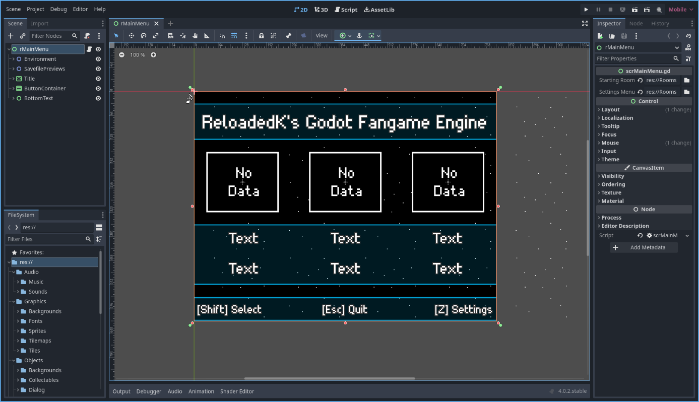
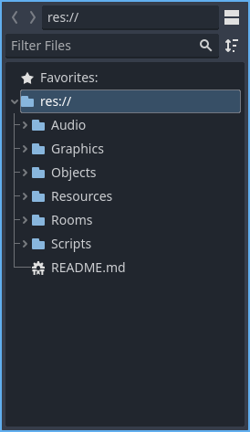

# Project structure

This section is dedicated to explaining the way the project is structured, why and how you would maintain it.

When you first open the project, to the center, you'll be greeted with a view of the first "room" (main scene) of the engine, named **rMainMenu**.

* To the top-right, you have the *Inspector*, *Node* and *History* tabs. The *Inspector* tabs allows you to view and edit node properties. The *Node* tab allows you to make use of the Signal and Group systems. The *History* tab shows you every change you made for the current scene.

* To the top-left, you have the *Scene* and *Import* tabs. The *Scene* tab shows you all the elements which compose your current scene (in this case, rMainMenu), and the *Import* tab allows you to define and modify some parameters related to several file types, such as textures. You'll spend most of the time using the *Scene* tab.

* To the bottom-left, you have the *FileSystem* tab. This is where a more detailed explanation is needed.

---

### The File System

Unlike Game Maker, Godot doesn't make a clear distinction between sprites (textures, in this case), audio files, objects (scenes) and rooms (also scenes). You need to *define* what they are, and keep them in separated locations. Avoid placing everything into just a couple folders, and put very strict rules on where each resource should go. If you don't do this, you'll eventually find yourself mixing rooms, objects, textures, scripts and more. You **do not** want to find yourself in that situation, so place things where they should be, even if it takes you a couple extra seconds.

This is how the file system structure looks when collapsed. Do note that every folder is kept inside of a single "root" folder called **res://**, which is essentially where everything related to a project is contained:

We'll now check each folder and get into more detail.

---

### Audio:

Contains files related to **music** and **sounds**. 

* **Music** are files related to the game's music. These can be .wav, .mp3 or .ogg. The format I recommend the most is .ogg, like the songs included in this engine, since it can be compressed without losing much quality and its quite flexible.
* **Sounds** are sound files. Their format should always be .wav.

---

### Graphics:

The graphical elements of the game. This includes **backgrounds**, **fonts**, **sprites**, **tilemaps** and **tiles**.

* **Backgrounds** are the graphics you want to use to draw things in the background, not including tiles.
* **Fonts** are sets of characters with different designs. Godot supports .ttf and .otf formats, of which I recommend using .otf.
* **Sprites** are two-dimensional graphical objects. They are divided into several categories:
    * **Collectables:** Items, secret items, etc.
    * **Dialog_system:** Graphics which involve the dialog system, including character portraits.
    * **Enemies:** Fully animated and intended for more complex, character-like hazards.
    * **Gimmicks:** Related to several types of objects which interact or are interactable by the player.
    * **Hazards:** Related to objects which should kill the player and are generally not very complex.
    * **Player:** Every animation or graphic that relates to the player object directly.
    * **Room_objects:** For objects which are meant to be placed in most rooms.
    * **System:** For graphics meant to be used outside of the main game, usually in menus.
    * **Trigger_system:** Meant to be used by the engine's trigger system. Put into it's own category to keep things more organized.
* **Tilemaps** are a category of graphics meant to be used with Godot's tilemap system. *These should not be used for walls or solids*, but rather for pieces of graphics which will repeat more than usual, like rows of spikes, vines, etc.
* **Tiles** are the kind of graphics used to build level's structures. Walls, solids and such should go here.

---

### Objects:

Objects are self-contained components of data. These are the fundamental building blocks of your game, and are divided into several categories. This includes **backgrounds**, **collectables**, **dialog_system**, **gimmicks**, **hazards**, **player**, **room_objects**, **system**, **tilemaps**, **triggers** and **UI**.

* **Backgrounds** contains several different types of backgrounds. Godot doesn't really know what they are or how they should behave, unlike Game Maker, so we have to define their behaviour first (should the background be a single colored rectangle?, a repeating texture?, should it scroll with the camera and if so, at which speed?).
* **Collectables** should be your game's items, secret items, etc.
* **Dialog_system** contains the engine's *dialog system*. objDialogBox is a standard, empty dialog box meant to be duplicated, modified and placed inside the "List" folder. Since each and every dialog is it's own separate scene, you can instance them, create them and destroy them in whatever way you like (objSign being one example of this use).
* **Gimmicks** are objects which interact or are interactable by the player. They have many different gameplay functions, but are not meant to kill the player (at least not directly).
* **Hazards** are objects meant to kill the player, which are not affected by triggers. This includes simpler objects, like floating cherries and spike tilemaps, or more complex ones like enemies. These last ones should go into the "Enemies" subfolder.
* **Player** includes both the player and objects related directly to it, like bullets, blood emitters and the game over screen.
* **Room_objects** contains objects meant to be used in rooms very commonly. This includes the camera objects, music player, warps, save points and save blockers.
* **System** contains objects which are used in menus or in a more abstract, global fashion. This includes the global HUD, sound manager and warp transitions.
* **Tiles** contains the tilemaps you will use to build your level's structures.
* **Trigger_system** includes both the main trigger object (meant to activate when the player collides with it), and different types of triggerable objects.
* **UI** contains menu related objects, such as generic buttons and the pause menu.

---

### Resources:

Resources are components of data which have more specific uses. They are divided into **licenses**, **materials** and **Project**.

* **Licenses** are placed here to properly credit some of the resources used in this engine. These include music, fonts and sprites.
* **Materials** are data components. They contain the instructions loaded by particle emitters in order to create particle effects. Due to how Godot works, saving materials as resources and preloading them via script is necessary to avoid stutters. In Godot v4.X, GPU particles seem to only work on the *Mobile* and *Forward+* renderers. This is probably considered a bug on Godot's part, and will likely be fixed in the future.
* **Project** includes the default sound bus, export presets config file and your game's icon. This was made to keep things more organized, as these resources are generated automatically on each project and would end outside of folders.

---

### Rooms:

Contains scenes meant to act as the game's rooms. Godot doesn't really know what "rooms" are, so we define them as scenes which contain other scenes, like objects. Your main project scene should be here, as the very first the game will run when executed. In this engine's case, it's **rMainMenu**.

* **00_Title_and_menus:** Contains the main menu, settings menu and controls menu. Despite the name, it does not include a title screen, as you might want to build your own, in your own style. Regardless, if it were to exist, it would also go here.
* **01_Testing_rooms:** Includes 2 testing rooms full of examples and use cases.
* **rTemplate:** Is a template room. It has the most basic node structure, and is meant to be duplicated.

---

### Script:

Scripts are files which contain the code or logic of your game. You write some code on them in a language Godot understands, and hopefully it does what you want it to do.

The specifics of scripting will not be discussed in this guide. As for the folder's structure, it's almost identical to the Objects one, save for 2 exceptions: **globals** and **shaders**.

* **Globals:** They are the most important pieces of logic in the engine. You can think of them as the "objWorld" equivalent in Game Maker's fangame engines. They are meant to handle very specific global tasks, such as loading and saving. Once you feel comfortable with GDScript, do take the time to read each one of them, since they are full of comments and divided into sections to make them as easy to understand as possible.
* **Shaders:** As the name implies, this folder is meant to contain every shader you make. I don't know much (if anything at all, really) about making shaders, so I'll leave this part to you. Have fun!.

---

**Previous page: [02. Engine Features](02_engine_features.md)**

**Next page: [04. Rooms](04_rooms.md)**
