# Rooms

This section will explain what rooms are, how they are structured and some of the basic tools used in the process of creating new ones.

---

### Scenes inside of scenes

Unlike Game Maker, Godot doesn't really know what "rooms" are, at least not until we define them. Rooms are meant to contain different types of data (objects, tiles, music, etc). We can do this by using scenes, meaning we will we creating "room scenes" which contain more scenes. This might sound confusing at first, but it really isn't much different from Game Maker's rooms. The .tscn (text scene) file format represents a single scene tree inside Godot, and you'll see that both objects and rooms share it. From now on, I'll be referring to these container scenes as "rooms".

We will be using the testing rooms provided by the engine in order to understand how they work. In the FileSystem tab, open the *Rooms* folder, then *01_Testing_rooms* and then *rTestRoom01*.

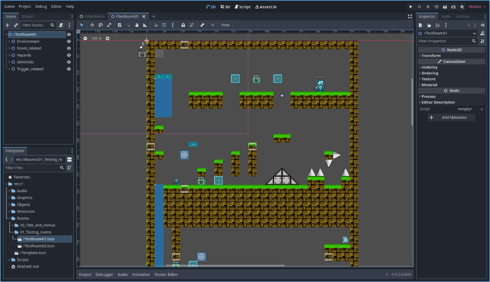

Before we start moving, adding and removing things from rooms, we should first look at how they're structured. Take a look at *rTestRoom01*'s Scene tab:

* rTestRoom01
    * Environment
    * Room_related
    * Hazards
    * Gimmicks
    * Trigger_related

Keep in mind, *rTestRoom01* is also the name of the *root node* of the scene. I tend to name both scenes and their root nodes by the same name (let's say our player scene is called "objPlayer". The root node of "objPlayer" is a CharacterBody2D, which I'll rename to "objPlayer". It's generally a good idea to rename the root nodes from scenes, to keep better track of what they are, even if it isn't strictly necessary).

Rooms are organized using Node2Ds with different names, indicating what kind of data (scenes) should go inside of them. We'll analyze them individually:

* **Environment:** Includes the most basic building blocks of a level, without including the player or objects which relate to the player. Your ***tiles***, ***backgrounds*** and ***music player*** go here. The reasoning for this is that a level should be able to exist even when things like a player or a camera are not present, which allows you to test how you want a level to look like before adding any gameplay element beforehand, hopefully speeding up development.

* **Room_related:** Includes every gameplay element that makes a room into an actual level. These include the ***player***, ***camera*** and ***room_objects*** (save points, save blockers and warps).

* **Gimmicks:** Includes any kind of additional gameplay element for the player. Simply put, every object inside the ***Gimmicks*** folder should go here. You could also include things like objSign, which relate to the ***dialog system***. Since dialog-related objects are not meant to kill the player, they're considered additional gameplay elements. Lastly, ***collectables*** could also be considered gimmicks, and be included here.

* **Hazards:** Includes ***objects capable and with the strict goal of killing the player***, regardless of how simple or complex they are. This category does not include hazards which are activated via the trigger system.

* **Trigger_related:** Includes ***triggers*** and ***triggerable objects***. Basically every object inside the ***Trigger_system*** folder should go here.

This node structure repeats in other rooms, like *rTestRoom02* and *rTemplate*. These rooms could be considered ***levels*** (I don't include the main menu rooms inside of this category, since they need more menu-specific structures). I came up with these rules because they made things cleaner, more organized and a lot less tedious to work with, however, they are not strict. You could (and probably should) make your own rules when it comes to making new rooms, if it makes you more effective. Nothing stops you from placing objects from the dialog system outside of the ***gimmicks*** category, which would make sense if you have tons of dialog nodes (in a long cutscene-like event, for example).

**In short:** having design rules when making rooms and organizing them accordingly ***will help you focus on how your rooms will look and feel***. These rules are dynamic and will likely change, according to type of room you're making (normal platforming levels, boss rooms, cutscenes, menus, etc).

---

### Your first level

There are 2 ways of making new rooms. One is opening a new tab, adding a Node2D as the root node and saving the scene. Doing this will leave you with an empty new scene, which can be used as a room. The other way is just copying *rTemplate*, renaming it and using it. This is the method I recommend, since it already has the basic level structure set up already, alongside an empty music player and a type of camera.

We'll name it ***rExampleRoom***.

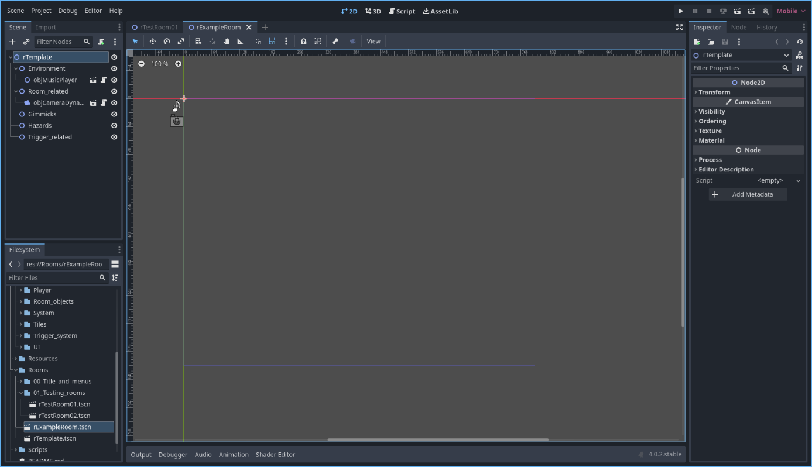

To run and test the current scene, you can press F6 or click the "run this scene" icon.

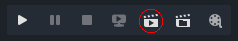

### Environment

The grey color from the background is the default "clear color", indicating that there's nothing there. We'll start by adding some tiles to our level. From the *Scene* tab, click the *Environment* node and press the small chain-like icon called "instantiate child scene". On the search bar, type "til32x32" and select it. Your room should now include a tilemap scene, which we'll use to create the level.

Now, go look at the bottom tabs and click on "TileMap". This will allow you to select and place the tiles.

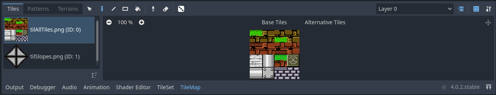

Click on the tile you want to select it, and a semi-transparent tile should appear where your mouse is when inside of the room. Right click to place a tile, left click to erase it. Use the colored lines to guide yourself and make a simple level.

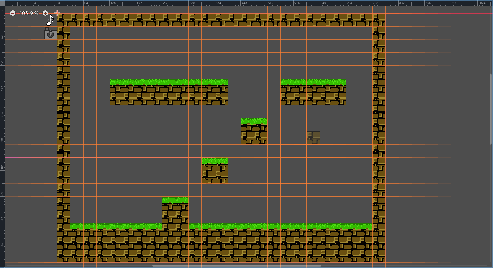

Now, we'll add a ***background***. Remember, Godot doesn't know what a "background" is, so we'll use one of our own premade ones. Again, select the *Environment* node and search for "background". We'll pick the one called ***objBackgroundColor***. Once instantiated, grab one of the points on the edge of the colored rectangle and drag it to the bottom-right extreme of the room. Inside of the *Inspector* tab, pick a color you like (I went with light blue, but pick whatever you want as long as there's enough contrast for you to know where the ground and walls are). It should look something like this:

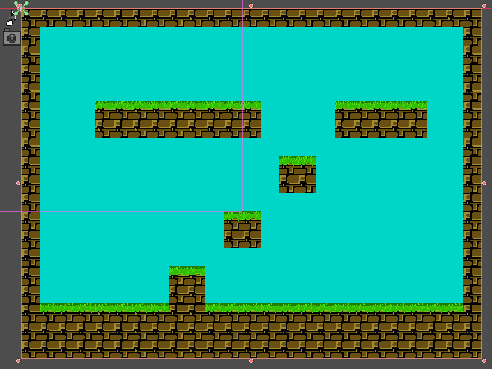

We'll add some ***music*** now. Click on ***objMusicPlayer***, and inside of the *Inspector* tab, you'll see a property named "Song ID". Click on "empty" and then select the option called "Quick load". From there, you should be looking at a menu which detects every audio file inside the project. Put "mus" on the search and it will return 2 results. We'll use a song called ***musLevel01.ogg***.

Now, we should take what we have and test it, so run the current scene by pressing F6. We should be looking at the entire room, void of gameplay elements and with music playing in the background. This is the most basic part of creating levels. Congratulations!.

### Room_related

We'll proceed by adding objects into the *Room_related* node. There's an object already instanced, named ***objCameraFixed***. As the name implies, this works as a basic, fixed-view camera. We won't be editing this object, as it already does what it's supposed to do.

In order to play the level, we need a ***player*** object and some basic ***room related elements***. Instance player object (named ***objPlayer***), and move it somewhere in the room that makes sense (press **W** in the room editor to enter the "move" mode, and **Q** to go back into the "select" mode).

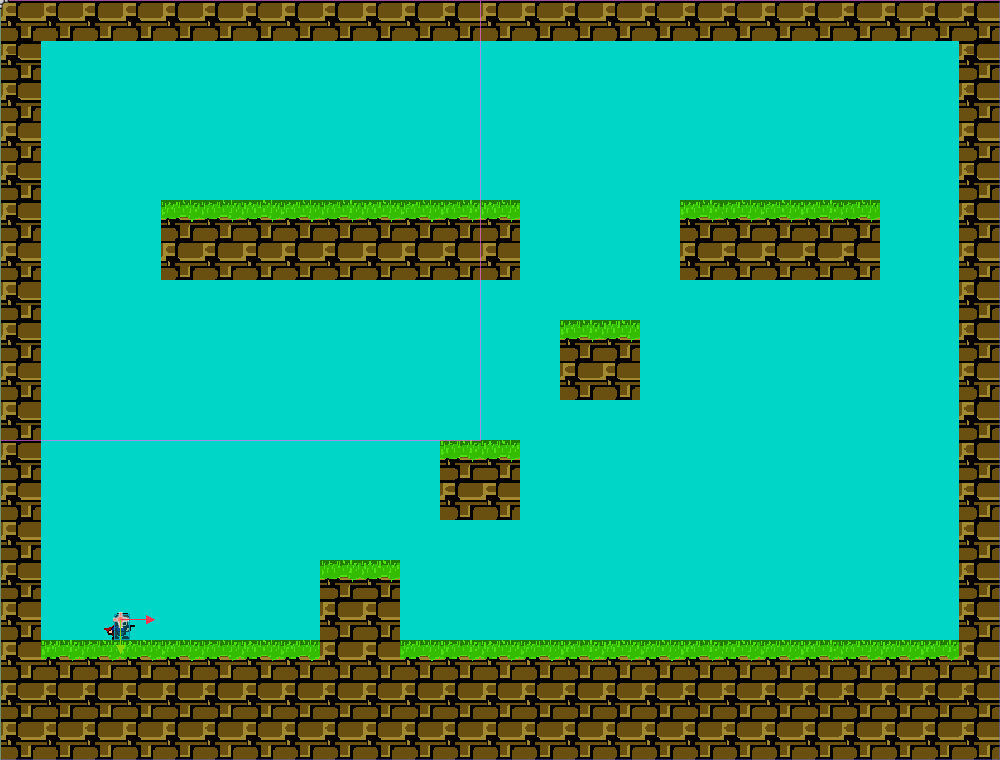

Now, we should add a ***save point*** and a ***warp***. Adding a save point is simple enough, but I'll show you a different way to do it. Go to your *Objects* folder, then *Room_related*, select objSavePoint, drag and drop it into your room. There's a catch: the object is outside of the *room_related* node. No issue, we'll go back to our *Scene* tab, select it and drag it into the *room_related* node. Problem solved!.

We'll do the same thing for our warp. Place it in your room using whichever method you prefer. Warps are slightly more complex objects, and for them to work, we'll need to define *where* they should warp the player to. Thankfully, due to how Godot works, we can just select a room or level by making use of an ***exported variable***, which is located inside of the *Inspector* tab as a node property. Click on the folder icon and it should take you to the root folder of the entire project, **res://**. It will look like this:

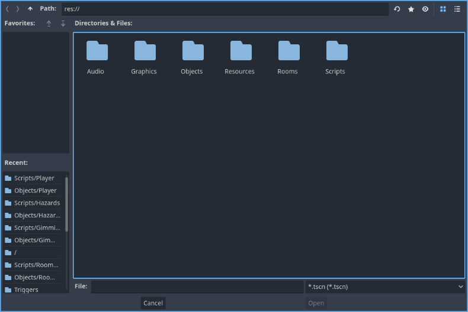

We have to locate the room we want to warp our player to. Go into the *Rooms* folder, *01_Testing_rooms* and select *rTestRoom01*. It should work without any trouble.

Before we test our level, select ***objCameraFixed***, go to its properties and click on *Target node*. From there, select *objPlayer*. If a camera object exists but doesn't have a target node, it won't throw an error but you'll see a clear room instead of your level.

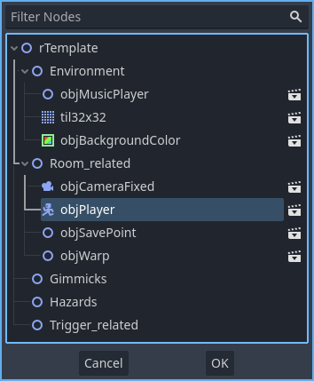

Once you're done, you should have a level with a basic layout, background, music, player, save point and warp. Use your keyboard/controller to move around and try to reach the warp. When you touch it, it should take you to ***rTestRoom01***. Let's look at the end result:

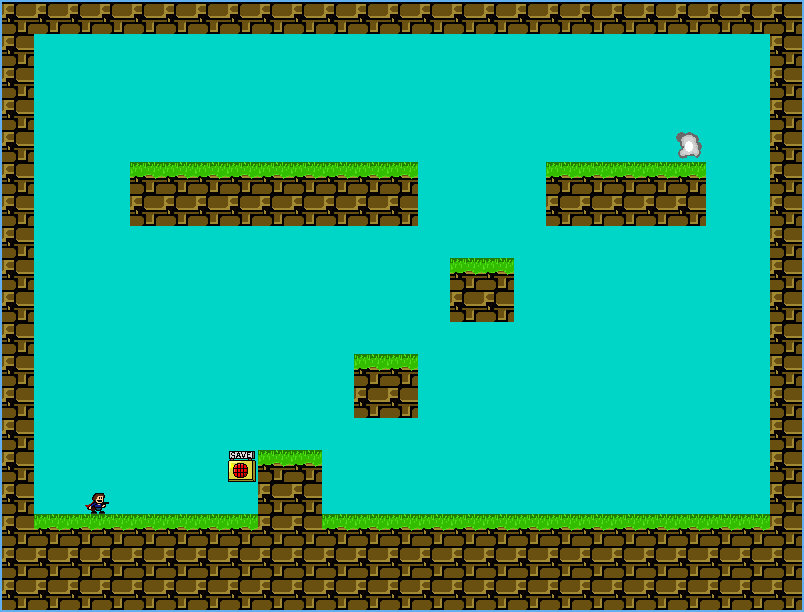

So far so good!.

Before we get into the next section of the guide, there's something we need to check. What happens if we save in this new room?. If we use the room's save point and press R, we should reset as expected. Now, if we go back into our main menu, you will notice that ***we saved inside of File 1***. This happens because "File 1" is used by default. The way this engine decides which file it should save to (1, 2 or 3) is ***through the main menu***, meaning if we want to both access this new level and save it into a different save file, we need to access it from the main game.

To do this, we'll create a warp inside of ***rTestRoom01***, to warp us into ***rExampleRoom***. Go into ***rTestRoom01***, place a warp *inside of the Room_related node*, and give it a room to warp to (in this case, ***rExampleRoom***).

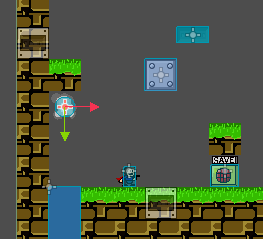

Now, you will be able to get to your newly created level without needing to run your specific scene. This is one way to do it, but what if you want to start from this level instead of rTestRoom01?.

For that, we'll need to go into our main menu scene. Let's do that right now. Go into ***Rooms, 00_Title_and_menus, rMainMenu***, and open the scene.

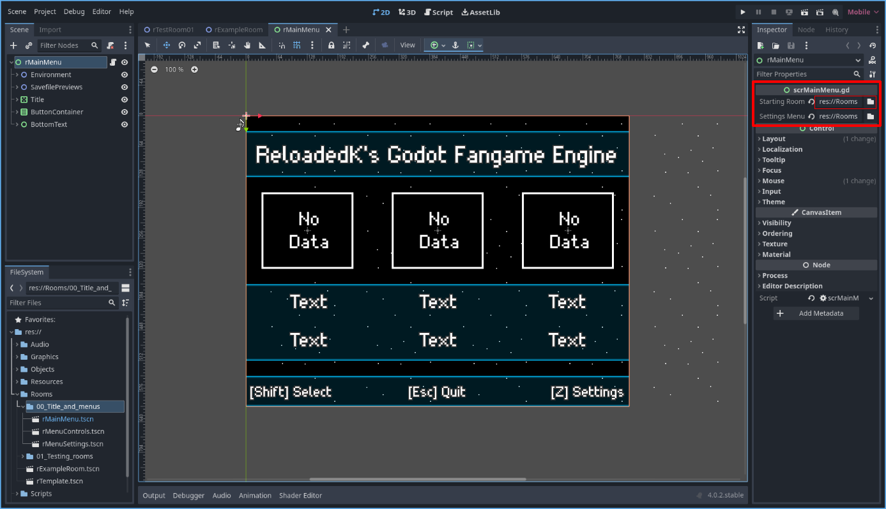

As soon as you open the scene, its root node will be selected (***rMainMenu***). To the right, inside of the *Inspector* tab, you'll see a property named *Starting Room*. Search for ***rExampleRoom***, and change it.

Now, the first room you'll start at from your main menu will be ***rExampleRoom***. Good job!.

---

### Gimmicks, Hazards and Trigger_related objects

We already know the basics of editing rooms, so this section will be a lot shorter. We'll add a couple objects into our level in order to make it more fun, starting with a ***gimmick***.

We'll start by adding a classic ***moving platform***. Add it into the scene (without forgetting to place it inside the *Gimmicks* node). When the scene is selected, you'll see that one of its properties is called *Move Speed*. We'll change it's x to 2, and test our room back to see what happens.

Our moving platform will move to the right at a speed of (2 * FPS), which equals to 120 pixels per second since our FPS is 60. Oddly enough, the platform won't bounce back when colliding with the solid walls. Why is this?

Put it short, objects like ***moving platforms***, ***moving blocks*** and ***bouncing cherries*** will not detect walls or solids, but will detect a tilemap named ***tilPlatformBlock***. We'll need to include this scene if we want to use any of the previously mentioned objects, so let's add it alongside our moving platform.

If you remember how we added our tiles, this is pretty much the same, save for the fact there's only a single tile. Select it from the *TileMap* tab, and make sure you're in *Select Mode* by pressing **Q** (don't be on *Move Move*). From there, add the platform block tiles where the platform should detect them. They should appear on top of the level's tiles and look similar to this:

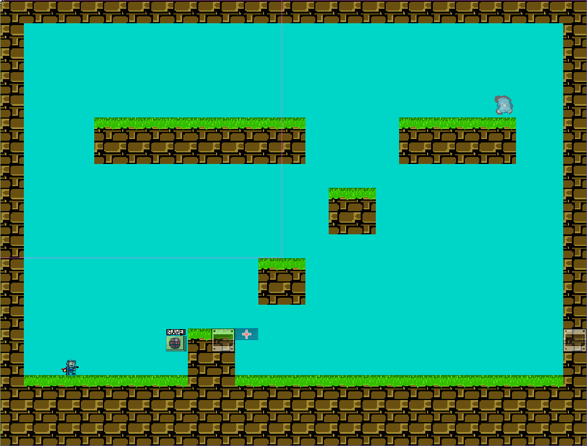

Now, if you test your level, the moving platform should move and bounce once it comes into contact with the platform block tiles.

We'll add another gimmick, a ***moving block***. Moving blocks will only move once the player stands on top of them. Add it to the level (don't forget to place it inside the *Gimmicks* node!), somewhere close to the player so it can jump on top and activate it. Add some *Move Speed* to it, and then open the small options menu inside *Collision interaction*. I won't explain how this menu works in detail, but I'll explain what each interaction does. ***None*** means the moving block won't detect any collision, ignoring platform blocks. ***Stop*** will make the moving block stop once it collides with a platform block. ***Bounce*** will make it reverse its movement direction once it detects a platform block, similar to how a moving platform does it. Select ***Bounce***, place ***platform blocks*** on its path and test it.

Mine looks like this:

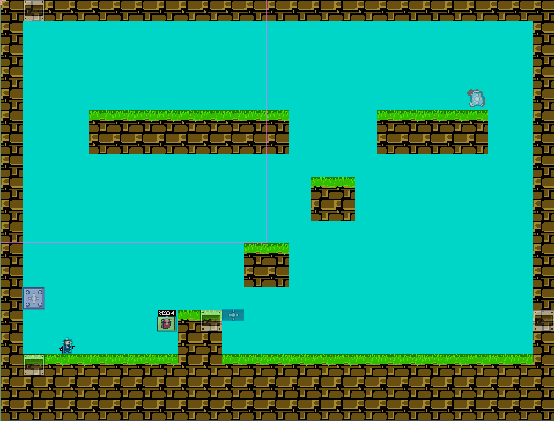

We're done with gimmicks. Time for ***Hazards***.

Some of the most basic hazards fangames use are ***spikes*** and ***cherries*** (some call them apples, some call them delicious fruits. It's been years and I still have no idea how I should call them, so I'll go with "cherries"). We'll add some spikes first. You can drag a scene (in this case, ***tilSpikes***) into another node in the *Scene tree* (in this case ***Hazards***). An exact position for ***tilSpikes*** isn't needed, since it's a tilemap and we'll place its tiles individually. Once it's added, select the spikes you want to add into your level and make something interesting with them.

Once you're done, we'll add some floating cherries. They won't do anything special other than floating and existing, so just go ahead and add 1 or 2 into your level. The end result should look similar to this:

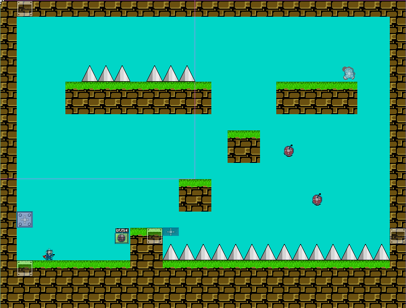

Hazards are done. Time for ***Trigger_related objects***.

A trigger system consists of 3 parts: a ***trigger***, a ***trigger event*** and a ***triggerable object***. A trigger is usually an invisible area, which detects another thing (a trigger event). In this case, the trigger event is ***a collision with the player***. Once it happens, the rest of the room will be notified, and if a triggerable object exists and has its same *Trigger ID*, it will activate.

A ***player object*** already exists inside of our level, so we'll need to add a ***trigger*** and a ***triggerable object***. Start by adding a trigger, located in ***Objects/Trigger_system/objTrigger***. Move it into a position you know the player will collide with. If you check it's node properties, you'll see one named *Trigger ID* and another named *Trigger Sound*. The default *Trigger ID* is 0, which will activate every triggerable object whose *Trigger ID* is also 0. The second property, *Trigger Sound*, will let you pick a .wav sound file from the project's files, which will get player once the trigger activates.

Now, let's add a ***triggerable object***. We'll use ***objTriggerCherry***, a simple cherry which, when activated, moves into a x,y direction. Set its velocity from the node's properties, place it somewhere in your room and check if its *Trigger ID* is the same as the trigger you placed before. If so, the cherry should move as soon as the player collides with the trigger.

The end result should look similar to this:

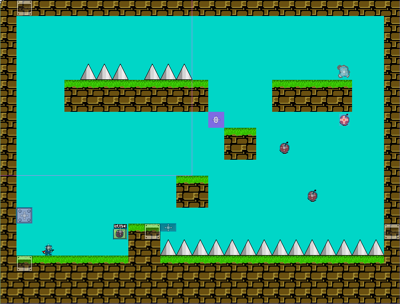

Congratulations!, now you know what rooms are, how they are structured, how to edit them and make new levels. Before moving to the next section, remember that the only way to truly learn is through practice. If you forget about something, don't be afraid to go back and read what you need.

---

**Previous page: [03. Project Structure](03_project_structure.md)**

**Next page: [05. Objects Overview](05_objects_overview.md)**
