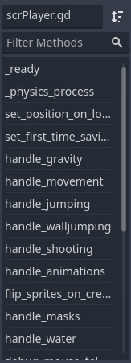

# The Player

This section will be entirely dedicated to the player object, showing its features, how it's structured, the way it works and the systems which relate to it.

---

### Features

* Basic movement with constant speed.
* Jumping and double jumping.
* Double jumping has a small visual effect.
* Shooting bullets.
* Water physics (infinite jumping when on water, slower falling speed).
* Walljumping on vines.
* Can die when crushed between 2 solids.
* Gets double jump back when touching moving platforms.
* Has a "frozen" state, which deactivates most actions except gravity and sprite animations.
* In god mode, it can get teleported to the mouse cursor position, and cannot be killed.
* Makes a save when starting the game for the first time.
* Can handle both block collisions and slopes.
* Modular design.

---

### Structure

The player's script is divided into 3 parts: ***Variable declarations***, ***Main logic loop*** and ***Custom methods***. This last one also includes a subpart which deals with ***Extra collisions***. 

* ***Variable declarations:*** The only part located outside of any function or method. This is were (most) variables are declared for later use in other sections of the script. These variables will be explained briefly:
    
    * ***gravity:*** Constant downwards force.
    * ***v_speed:*** Initial max vertical falling speed.
    * ***h_speed:*** Horizontal speed.
    * ***s_jump_speed:*** Single jump speed.
    * ***d_jump_speed:*** Double jump speed.
    * ***jump_release_falloff:*** Force after releasing the jump key.
    * ***xscale:*** Where the player is facing (left / right).
    * ***frozen:*** Puts the player in a "frozen" like state, disabling inputs and movement.
    * ***d_jump:*** Whether double jumping is allowed.
    * ***d_jump_aux:*** Auxiliar djump for when the player is inside of platforms.
    * ***in_water:*** Indicates if the player is inside water.
    * ***v_speed_modifier:*** Adds to v_speed. Used in water physics and walljumping.
    * ***can_walljump:*** Indicates if the player is colliding a vine.
    * ***is_walljumping:*** The active walljump state.
    * ***animated_sprite:*** To handle animations without referencing AnimatedSprite2D every time.
    * ***create_bullet:*** Preloads a "bullet" scene, for later instancing
    * ***jump_particle:*** Preloads a "jump particle" scene, for later instancing

* ***Main logic loop:*** This section mainly uses a method called "_physics_process()", which is Godot's "step" event. It runs at a fixed rate that doesn't change, which is 60fps in this engine's case. Most of the logic should be handled by specific methods, to keep better track of what's happening.

* ***Custom methods:*** Specific functionality made for all sorts of things, from movement related things like jumping, to selecting the proper sprites for animations, etc. Helps keeps the code from the main loop a lot cleaner.

    * ***Extra collisions:*** These methods are automatically created by using signals, so their names are a little less readable. There are 2 types of collisions: bodies and areas. Bodies can only interact with bodies. Areas can only interact with areas. Doing things this way requires using more nodes, but it also allows the maker to easily add or remove collisions, and ends up being less confusing in the end while also requiring less code. It also allows for collisions with different shapes, useful for things like vines.

---

### Inner workings

There are 2 main things to be aware of:

* The player is made up of lots of methods.
* Its main loop calls those methods to keep itself from getting too difficult to read and understand.
    
To search for a particular method, you can either scroll to your desired location or use the "methods filter", to the bottom left of the scripts window.

Every method has a main comment on top of it, roughly explaining what they do. They're also packed with comments, so I'll avoid explaining how they work here.

---

### Related systems

As with any game, the player will likely be the object which will relate the most with ***other objects*** or global systems (***autoloads***). Objects which relate to the player tend to detect it indirectly, by using an autoload (GLOBAL_INSTANCES.objPlayerID). This works by using a function named *is_instance_valid()*, which is Godot's equivalent to Game Maker's *instance_exists()*.

* ***Objects:***
    
    * ***objBullet:*** Created by the player, instantiates preloaded bullet scenes and gives them a direction. Called from *handle_shooting()*.
    * ***objJumpParticle:*** Created by the player, instantiates preloaded jump particle scenes. Called from *handle_jumping()*.
    * ***objMovingPlatform:*** The player will detect if it's colliding with a moving platform (inside of it, not standing on top of it). If this is true, it will gain infinite double jumping, which is nice for repositioning and it matches the behaviour of other fangame engines.
    * ***Hazards / killers:*** On contact, they will be detected by the player and will call *on_death()*.
    * ***objWater:*** The player will change its gravity values by changing *v_speed_modifier*. Called from *handle_water()*.
    * ***tilVines:*** Tells the player if it should change its state to the walljumping one, as long as some conditions are previously met. Changes its gravity values by changing *v_speed_modifier*. Called from *handle_walljumping*.
    * ***objWarp:*** Keeps the direction the player is looking at (xscale) when warping.
    * ***objMovingBlock:*** Checks if the player is standing on top of it and is floored. If true, it activates.
    * ***objPhysicsBox:*** Checks if the player exists and uses duck typing to detect if it's colliding with it, and which side it's colliding from.
    * ***objInvisibleBlock:*** Checks if the player exists and uses duck typing to detect if it's colliding with it, turning blocks visible again.
    * ***objSign:*** Checks if the player exists and is colliding, among other conditions before spawning a dialog box.
    * ***objDialogBox:*** If the player exists, it puts it into a frozen state when spawned and removes it when destroyed.
    * ***objTriggerCherryOrbit:*** Checks if the player exists and gets its position.
    * ***objTriggerCherryTowards:*** Checks if the player exists and gets its position.
    * ***objHud:*** Checks if the player exists and gets its position.
    * ***objDummyEnemy:*** Checks if the player exists and gets its position.
    * ***objJumpSwitchSpikeUp / objJumpSwitchSpikeDown:*** Checks if the player exists and changes state (shown, hidden) only if this returns true.

* ***Autoloads:***
    * ***scrGlobalInstances:*** Is called and used by other objects to detect if the player scene exists in the level. When a level loads, if the player exists, it sets a variable called *objPlayerID* to it's ID, which can then be referenced globally.
    * ***scrGlobalSaveload:*** Is used to save the player's position and xscale.
    * ***scrGlobalGame:*** Doesn't relate to the player directly, but it does set god mode with a key combination, which changes some of its functionality (allows it to teleport to the cursor's position on right click and disables collision events with hazards).
    
---

**Previous page: [05. Objects Overview](05_objects_overview.md)**

**Next page: [07. Autoloads](07_autoloads.md)**
