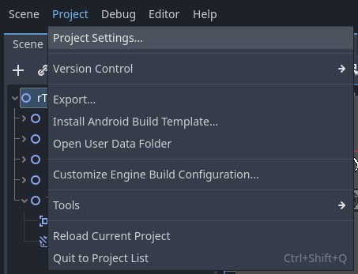
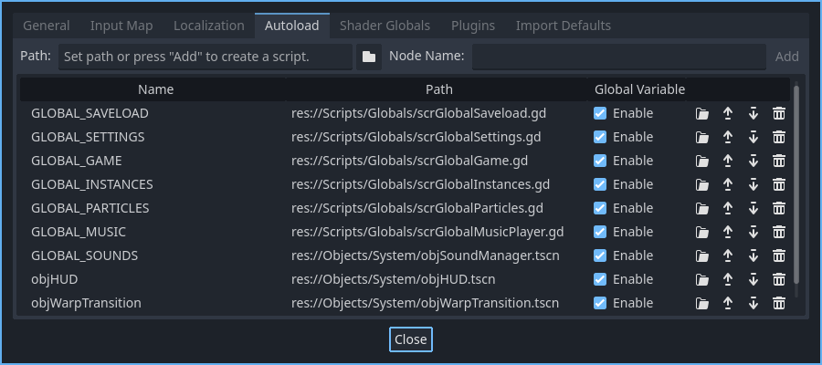

# Autoloads and global systems

This section will be dedicated to explaining what autoloads are, how they work and their uses in this engine.

---

### Persistent information

Autoloads are a way to store data permanently, allowing other objects to access it from anywhere, no matter the scene. They allow you to do things like declaring, reading and writing global variables, play non-repeating music even when a level changes, referencing the player object by its ID or save your game's data.

This engine makes heavy use of autoloads, but it does so knowing when and how to use them. In other fangame engines, there's usually an object called "world" or "objWorld", which in essence does very similar things (handling function keys, taking care of music, initializing global variables, loading config files, etc). The trade-off when using autoloads is increased risk of coupling, so you have to be aware of what they do and luckily, Godot helps you do with this.

First, we'll take a look at the autoloads used in this engine by going into the ***Project Settings:***

As you can see, there are a few. I prefer having multiple autoloads with specific tasks instead a single "god object", which does everything. They also need to be loaded with a specific order, like the one shown above, due to their contents (savefiles and settings are loaded first, things like sound and music loading are done after, etc). We'll take a look at them individually, following their order inside of the ***Project Settings***.

---

### Analysis

* ***GLOBAL_SAVELOAD:*** Loaded from ***scrGlobalSaveload.gd***. This autoload script:
	1. Saves data inside of a dictionary.
	2. Saves can be encrypted with either a string password (which would allow for saves to be shared between computers), or with a unique ID (sharing will not work). Since they'll be encrypted, a user will not be able to read and edit their values manually. If you use a string password, I recommend using your game's name for it, since it will be unique to it and would still allow save sharing.
	3. The save files have an ID (1 to 3).
	4. All files are saved inside of a "Data" folder, which cleans things up.
	5. Takes a screenshot and saves it resized for the main menu files.

    Keep in mind, this script mainly handles the save data. Check scrGlobalGame.gd to see how resetting is implemented, for example.

* ***GLOBAL_SETTINGS:*** Loaded from ***scrGlobalSettings.gd***. This autoload script:
    1. Saves data inside of a .ini config file, unlike GLOBAL_SAVELOAD.
    2. Unencrypted by default (can be changed, but it's not as important as encrypting savefiles).
    3. Sets vsync and window modes when loaded.
    4. Saves the game's ***music volume***, ***sound volume***, ***window mode***, ***vsync mode***, ***autoreset*** and ***controls / input map***.

* ***GLOBAL_GAME:*** Loaded from ***scrGlobalGame***. This autoload script is meant to handle general global actions, like the functionality of the function keys, pausing, resizing a window, toggling fullscreen, restarting the game, and so on. You'll also find things like the global trigger array, debug mode and global input device variables. It works as a more specific *objWorld*, similar to Game Maker's fangame engines. It should be loaded **after** GLOBAL_SAVELOAD and GLOBAL_SETTINGS.

* ***GLOBAL_INSTANCES:*** Loaded from ***scrGlobalInstances.gd***. This autoload script is used by other objects to reference the player globally, using the objPlayerID variable. This is set from the player, as soon as it loads, from its _ready() method.

    You could use it to reference other instances, but as of now it's only used for the player.

* ***GLOBAL_PARTICLES:*** Loaded from ***scrGlobalParticles.gd***. This autoload script is used to preload each particle material at startup, so they don't need to get compiled as soon as a new particle is emitted, causing stuttering. Doing this will increase the load time at startup, but it's a better trade-off when it comes to gameplay, which is prioritized.

* ***GLOBAL_MUSIC:*** Loaded from ***scrGlobalMusicPlayer.gd***. This autoload script is used as the game's global music player. Since it's an autoload, the music will not stop when changing rooms or levels, unless the song's ID changes. This script does the actual music playing, music changing and looping, and its values are set from ***objMusicPlayer***.

* ***GLOBAL_SOUNDS:*** Loaded from ***objSoundManager.tscn***. This is an autoloaded scene with both a script and several nodes. It preloads every sound effect in the game so they only need to be loaded once and referenced later, and uses a function to assign a new sound inside an array of AudioStreamPlayer nodes, allowing many sounds to be played at the same time, without interruption.

* ***objHUD:*** Loaded from ***objHUD.tscn***. This is an autoloaded scene with both a script and several nodes. It is always active but invisible by default, unless the player exists in the current room and debug/god mode is set to true. A HUD should only need to be created once at the start of the game and be shown or hidden according to the game's needs.

* ***objWarpTransition:*** Loaded from ***objWarpTransition.tscn***. This is an autoloaded scene meant to be referenced by any object which changes levels, like objWarp. You can create custom scene transitions and reference them through its functions.

---

**Previous page: [06. The Player](06_the_player.md)**

**Next page: [08. Maker's notes](08_makers_notes.md)**
